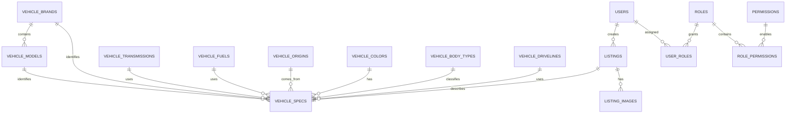

# CarX - Phase 0 Design Baseline

**Trạng thái:** Baseline v0.1, dùng làm cổng nghiệm thu trước Phase 1
**Nguồn yêu cầu:** `Talent.Project CarX.Hệ thống đăng tin mua bán ô tô.pdf`

## 1. Mục tiêu và nguyên tắc

CarX là marketplace đăng tin mua bán ô tô, có hai bề mặt sử dụng:

- **Customer site:** tìm kiếm, xem chi tiết và đăng tin ô tô.
- **Admin site:** quản lý khách hàng, tin xe, danh mục xe và nhân viên.

Nguyên tắc triển khai:

1. Mở rộng nền tảng hiện tại, không viết lại từ đầu.
2. Giữ `/api/v1/listings`, auth, `locations`, `conditions`, `listings` và `listing_images` để giảm rủi ro.
3. Dữ liệu đặc thù ô tô nằm ở `vehicle_specs` và các bảng lookup riêng.
4. Lookup xe dùng soft-delete (`is_active`), không xóa cứng dữ liệu đang được tham chiếu.
5. Migration Flyway chỉ forward-only; không sửa các migration V1-V21 đã tồn tại.
6. Admin dùng cùng frontend nhưng tách route `/admin`; backend vẫn là ranh giới bảo mật bắt buộc.

## 2. Phạm vi MVP đã chốt

### Thông tin xe bắt buộc

| Nhóm | Trường | Cách lưu |
|---|---|---|
| Nhận diện | Hãng xe | `vehicle_brands` |
| Nhận diện | Dòng xe | `vehicle_models` |
| Tình trạng | Tình trạng xe | `listings.condition_id` hiện có |
| Kỹ thuật | Năm sản xuất | `vehicle_specs.manufacture_year` |
| Kỹ thuật | Hộp số | `vehicle_transmissions` |
| Tài chính | Giá | `listings.price_amount` hiện có |
| Kỹ thuật | Nhiên liệu | `vehicle_fuels` |
| Nguồn gốc | Xuất xứ | `vehicle_origins` |
| Ngoại hình | Màu xe | `vehicle_colors` |
| Phân loại | Kiểu dáng | `vehicle_body_types` |
| Kỹ thuật | Số chỗ ngồi | `vehicle_specs.seat_count` |
| Kỹ thuật | Dẫn động | `vehicle_drivelines` |
| Media | Ảnh | `listing_images` và `media_assets` hiện có |
| Vị trí | Tỉnh/thành | `listings.location_id` hiện có |

**Bổ sung hợp lý từ giao diện tham khảo:** số kilomet (`mileage_km`) là trường tùy chọn trong MVP, dùng được cho lọc nhưng không chặn đăng tin nếu không có dữ liệu.

### Bộ lọc tìm kiếm

API phải hỗ trợ tối thiểu sáu tiêu chí. Baseline hỗ trợ:

`keyword`, hãng, dòng xe, tình trạng, năm sản xuất, giá, hộp số, nhiên liệu, xuất xứ, màu, kiểu dáng, số chỗ, dẫn động, tỉnh/thành và số kilomet.

### Gợi ý không cần đăng nhập

Customer site lưu bộ lọc tìm kiếm gần nhất ở trình duyệt. Khi người dùng chưa đăng nhập, frontend gửi các tiêu chí phù hợp tới endpoint recommendations. Backend ưu tiên:

1. Cùng hãng xe.
2. Khoảng giá giao với khoảng giá đã tìm.
3. Cùng dòng xe hoặc khu vực nếu có.
4. Tin đang active, chưa bị archive và không trùng tin đang xem.

Không lưu lịch sử tìm kiếm ẩn danh vào hồ sơ người dùng trong MVP.

## 3. Mô hình dữ liệu



### Bảng mới

| Bảng | Vai trò | Khóa/chỉ mục chính |
|---|---|---|
| `vehicle_brands` | Hãng xe | `code` unique, `is_active` |
| `vehicle_models` | Dòng xe thuộc hãng | `(brand_id, code)` unique |
| `vehicle_origins` | Xuất xứ | `code` unique |
| `vehicle_transmissions` | Hộp số | `code` unique |
| `vehicle_fuels` | Nhiên liệu | `code` unique |
| `vehicle_colors` | Màu xe | `code` unique |
| `vehicle_body_types` | Kiểu dáng | `code` unique |
| `vehicle_drivelines` | Dẫn động | `code` unique |
| `vehicle_specs` | Thuộc tính xe, quan hệ 1-1 với listing | `listing_id` PK; index theo hãng/năm và các lookup |
| `permissions` | Quyền thao tác | `code` unique |
| `role_permissions` | Gán quyền cho role | `(role_id, permission_id)` PK |

`vehicle_specs` dự kiến có các cột: `listing_id`, `brand_id`, `model_id`, `manufacture_year`, `transmission_id`, `fuel_id`, `origin_id`, `color_id`, `body_type_id`, `seat_count`, `driveline_id`, `mileage_km`.

Giá, tình trạng, tỉnh/thành, người bán, trạng thái và thời gian đăng tiếp tục lấy từ `listings` hiện tại. Ảnh tiếp tục dùng `media_assets`/`listing_images`.

### Thứ tự migration dự kiến

| Migration | Nội dung | Ghi chú |
|---|---|---|
| `V22` | Tạo các bảng lookup xe | Chỉ DDL |
| `V23` | Tạo `vehicle_specs`, FK và index | Chỉ DDL |
| `V24` | Seed hãng, dòng xe và lookup mẫu | Chỉ DML |
| `V25` | Tạo `permissions` và `role_permissions` | Chỉ DDL |
| `V26` | Seed permission/role mapping | Chỉ DML |
| `V27` | Mapping role cũ hoặc backfill nếu database thực tế cần | Chỉ tạo khi có dữ liệu cần xử lý |

Không tạo dữ liệu xe giả để ép các listing cũ vào schema mới. Listing cũ sẽ được giữ nguyên; listing CarX mới bắt buộc có `vehicle_specs` ở tầng service và validation.

## 4. API contract

### Quy ước chung

- Base path: `/api/v1`.
- Tên resource số nhiều, chữ thường, kebab-case.
- Danh sách dùng `page` zero-based và `size`, giữ tương thích với Spring `Page` hiện tại.
- `size` giới hạn 1-100; mặc định 20.
- Mặc định listing: active, mới đăng trước.
- Thành công dùng status code đúng ngữ nghĩa: `200`, `201`, `204`.
- Lỗi tiếp tục dùng `ProblemDetail`, bổ sung `code` và `fieldErrors` khi cần.
- Endpoint public phải có rate limit riêng cho anonymous.

### Customer/public API

| Method | Endpoint | Auth | Mục đích |
|---|---|---|---|
| `GET` | `/listings` | Không | Tìm kiếm, lọc và phân trang tin xe |
| `GET` | `/listings/{id}` | Không | Xem chi tiết tin xe |
| `GET` | `/listings/recommendations` | Không | Gợi ý theo hãng/khoảng giá từ bộ lọc gần nhất |
| `GET` | `/vehicle-catalog` | Không | Lấy toàn bộ lookup phục vụ form/filter |
| `GET` | `/vehicle-catalog/brands/{brandId}/models` | Không | Lấy dòng xe theo hãng |
| `POST` | `/listings` | Có | Đăng tin xe và `vehicle` object |
| `PATCH` | `/listings/{id}` | Có, owner | Sửa tin xe |
| `DELETE` | `/listings/{id}` | Có, owner | Archive tin xe |
| `GET` | `/listings/mine` | Có | Danh sách tin của người dùng |

Các query param chính của `GET /listings`:

```text
keyword, brandId, modelId, conditionId, minYear, maxYear,
minPrice, maxPrice, transmissionId, fuelId, originId, colorId,
bodyTypeId, seatCount, drivelineId, locationId,
minMileageKm, maxMileageKm, page, size, sort
```

Payload đăng/sửa giữ metadata listing hiện tại và thêm object:

```json
{
  "title": "Toyota Vios 2022",
  "description": "...",
  "priceAmount": 520000000,
  "conditionId": 3,
  "locationId": 4,
  "addressDetail": "...",
  "vehicle": {
    "brandId": 1,
    "modelId": 8,
    "manufactureYear": 2022,
    "transmissionId": 2,
    "fuelId": 1,
    "originId": 1,
    "colorId": 3,
    "bodyTypeId": 1,
    "seatCount": 5,
    "drivelineId": 1,
    "mileageKm": 32000
  }
}
```

### Admin API

Các API admin hiện có được giữ lại và đổi guard từ role cứng sang permission:

```text
/admin/users
/admin/listings
/admin/reports
/admin/locations
/admin/audit-logs
```

API mới:

```text
GET    /admin/vehicle-catalog/{resource}
POST   /admin/vehicle-catalog/{resource}
PUT    /admin/vehicle-catalog/{resource}/{id}
PATCH  /admin/vehicle-catalog/{resource}/{id}/activate
PATCH  /admin/vehicle-catalog/{resource}/{id}/deactivate
GET    /admin/roles
GET    /admin/permissions
PUT    /admin/users/{id}/roles
```

`{resource}` chỉ nhận allowlist: `brands`, `models`, `origins`, `transmissions`, `fuels`, `colors`, `body-types`, `drivelines`.

## 5. Ma trận phân quyền

Role đích của CarX:

- `USER`: người mua/người bán thông thường.
- `STAFF_CUSTOMER`: quản lý thông tin và trạng thái khách hàng.
- `STAFF_CONTENT`: quản lý tin xe và danh mục xe.
- `ADMIN`: toàn quyền quản trị và phân quyền nhân viên.

| Permission | USER | STAFF_CUSTOMER | STAFF_CONTENT | ADMIN |
|---|---:|---:|---:|---:|
| `customer.read` |  | ✓ |  | ✓ |
| `customer.update_status` |  | ✓ |  | ✓ |
| `listing.read_admin` |  |  | ✓ | ✓ |
| `listing.moderate` |  |  | ✓ | ✓ |
| `vehicle_catalog.read` |  |  | ✓ | ✓ |
| `vehicle_catalog.write` |  |  | ✓ | ✓ |
| `location.write` |  |  |  | ✓ |
| `staff.read` |  |  |  | ✓ |
| `staff.write` |  |  |  | ✓ |
| `audit.read` |  |  |  | ✓ |
| `system.read` |  |  |  | ✓ |

Nguyên tắc bảo mật:

1. Deny by default.
2. `/api/v1/admin/**` yêu cầu đăng nhập; từng method kiểm tra permission cụ thể.
3. Không cho nhân viên tự cấp quyền hoặc thay đổi role của chính mình.
4. Không cho hạ quyền tài khoản `ADMIN` cuối cùng.
5. Mọi thay đổi user role, trạng thái user, listing và lookup phải ghi audit log.
6. Dữ liệu form phải dùng Bean Validation; SQL phải qua repository hoặc parameter binding.

Role cũ được xử lý an toàn: `USER` giữ nguyên, `ADMIN` giữ quyền cao nhất; `MODERATOR` chỉ được mapping sang `STAFF_CONTENT` sau khi kiểm tra dữ liệu thực tế.

## 6. Cổng nghiệm thu Phase 0

- [x] Có đủ 13 nhóm thông tin xe theo PDF.
- [x] Có mô hình `vehicle_specs` 1-1 với `listings`.
- [x] Có tối thiểu 6 tiêu chí tìm kiếm; baseline có hơn 10.
- [x] Có luồng gợi ý không cần đăng nhập.
- [x] Có schema lookup để admin cập nhật dữ liệu xe.
- [x] Có API contract public/customer/admin.
- [x] Có ma trận permission nhiều cấp.
- [x] Có chiến lược migration forward-only, không sửa V1-V21.
- [x] Có tiêu chí bảo mật và audit cho admin.

## 7. Bàn giao cho Phase 1

Phase 1 được phép bắt đầu khi sử dụng đúng baseline này:

1. Backend/Data agent sở hữu V22-V24, entity, DTO, repository và API listing/catalog.
2. Security/Admin backend agent sở hữu V25-V27, permission evaluator và admin API guard.
3. Customer/Admin frontend chỉ dùng các endpoint và field đã nêu ở trên.
4. Mọi thay đổi schema hoặc API phải cập nhật tài liệu này trước khi code.
